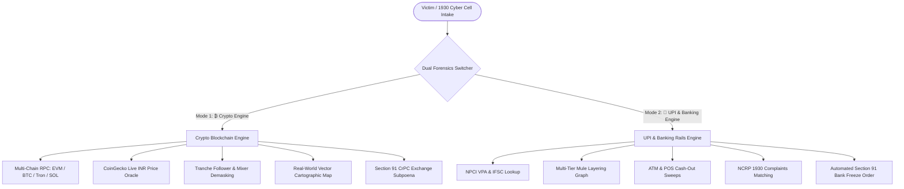
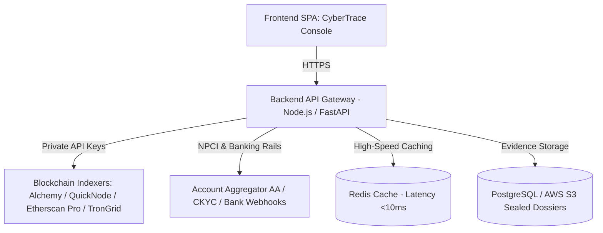

# 🛡️ CyberTrace — Enterprise Crypto & UPI Banking Forensics Platform

> **Smart India Hackathon 2026 &bull; Problem Statement PS-26183**  
> *Ministry of Home Affairs &bull; Indian Cyber Crime Coordination Centre (I4C)*  
> **Title:** Real-Time Identification of Fraud-Linked Cryptocurrency Exchanges & Banking Rails from Victim-Reported Suspect Identifiers through Automated Forensics Analytics

[](https://opensource.org/licenses/MIT)
[](https://www.sih.gov.in)
[]()
[]()

---

## 🌐 Live Access & Deployment

- 🚀 **Live Web Application (GitHub Pages):** [https://hidayatulla268.github.io/CyberTrace/](https://hidayatulla268.github.io/CyberTrace/)
- 📄 **Documentation PDF Guide:** [Download `CyberTrace_Platform_Guide.pdf`](https://github.com/Hidayatulla268/CyberTrace/blob/main/CyberTrace_Platform_Guide.pdf)

---

## 🌟 Dual Forensics Engine Architecture

CyberTrace features an integrated **Dual-Engine Architecture** accessible via the top navigation switcher:



---

## 🧪 Built-In Realistic Testing Presets

### Mode 1: ₿ Crypto Blockchain Engine Testing Presets

| Preset | Target Wallet Address | Modus Operandi & Crime Case | Total Loss | Risk Score | CEX / Off-Ramp Attribution |
| :--- | :--- | :--- | :--- | :--- | :--- |
| **⚡ Preset 1** | `0x098B716B8Aaf21512996dC57EB0615e2383E2f96` | **Lazarus Group APT-38 Exploit** (State-sponsored multi-sig drain) | **₹18.50 Cr** | **98% (Critical)** | Tornado.Cash 100 ETH Mixer &bull; Binance Off-Ramp |
| **💼 Preset 2** | `0xA1b2C3d4E5f6A7B8C9D0E1F2A3B4C5D6E7F8A9B0` | **Telegram Task Job Scam** (Hydra-Peel 3-hop automated peeling chain) | **₹84,500** | **91% (High Risk)** | WazirX India Gateway Hot 02 |
| **👮 Preset 3** | `0x742d35Cc6634C0532925a3b844Bc454e4438f44e` | **Digital Arrest Sextortion** (Police impersonation & permit2 drainer) | **₹1,50,000** | **96% (Critical)** | CoinDCX Off-Ramp Hub &bull; Dubai OTC Desk |
| **📈 Preset 4** | `0x89205A3E3b2A69De6DBf7F01ed13B2108B2C43e7` | **Pig Butchering Scam** (Fake high-yield liquidity mining arbitrage) | **₹1.45 Cr** | **88% (High Risk)** | OKX & KuCoin Multi-Sig Vault |
| **🏛️ Preset 5** | `0x28C6c06298d514Db089934071355E5743bf21d60` | **Binance Hot Wallet 14** (Verified clean institutional exchange control) | **₹2,840 Cr** | **12% (Verified Safe)** | Binance Holdings Ltd. (0 NCRP FIRs) |

---

### Mode 2: 📱 UPI & Core Banking Rails Engine Presets

| Preset | Target VPA / Bank UTR | Linked Core Bank Account & Branch | Reported Loss | FIRs Linked | Actionable Retrievable Balance |
| :--- | :--- | :--- | :--- | :--- | :--- |
| **💼 Preset 1** | `daily.payout@oksbi` | **State Bank of India** (Andheri East, Mumbai &bull; `SBIN0001245`) | **₹84,500** | **14 Complaints** | **₹30,420** (SBI Surat Mule Account) |
| **👮 Preset 2** | `cbi.investigation.fund@okaxis` | **Axis Bank** (Connaught Place, New Delhi &bull; `UTIB0000188`) | **₹1,50,000** | **22 Complaints** | **₹54,000** (Axis Bank Escrow Mule) |
| **⚡ Preset 3** | `quick.pay24@ybl` | **Yes Bank Limited** (Indiranagar, Bengaluru &bull; `YESB0000412`) | **₹25,000** | **8 Complaints** | **₹9,000** (Yes Bank QR Mule) |
| **💡 Preset 4** | `UTR-20260825-991240` | **Punjab National Bank / HDFC** (Salt Lake, Kolkata &bull; `PUNB0142800`) | **₹42,000** | **6 Complaints** | **₹15,120** (PNB Remote APK Mule) |
| **🏏 Preset 5** | `vip.gaming.deposit@paytm` | **Paytm Payments Bank** (Sector 62, Noida &bull; `PYTM0123456`) | **₹2,10,000** | **31 Complaints** | **₹75,600** (Paytm Merchant Escrow) |

---

## 🗺️ Authentic Real-World Vector Cartographic Map

CyberTrace replaces abstract graphs with **high-definition SVG vector landmass cartography** representing the authentic World continents, Arabian Peninsula, Middle East, Southeast Asia, and a detailed **Indian Subcontinent & Indian Ocean** coastline:

- **Exact City Coordinates**:
  - **Indian Police Cyber Cells**: Mumbai (`18.9°N, 72.8°E`), New Delhi (`28.6°N, 77.2°E`), Bengaluru (`12.9°N, 77.5°E`), Hyderabad (`17.3°N, 78.4°E`), Kolkata (`22.5°N, 88.3°E`), Surat (`21.1°N, 72.8°E`).
  - **International Off-Ramp Hubs**: Dubai UAE (`25.2°N, 55.2°E`), Singapore (`1.3°N, 103.8°E`), Hong Kong (`22.3°N, 114.1°E`), Bangkok (`13.7°N, 100.5°E`), Zurich (`47.3°N, 8.5°E`), London (`51.5°N, 0.1°W`), Seychelles (`4.6°S, 55.4°E`).
- **Dynamic Visuals**: Latitude/longitude graticules (Equator, Tropic of Cancer, Meridians), Indian Ocean radar scan rings, and animated great-circle trajectory flight arcs with glowing moving packets.

---

## 🏆 Global Platform Comparison Matrix

| Capability | Chainalysis Reactor | TRM Labs | Arkham Intelligence | Elliptic | **CyberTrace (Ours)** |
|---|:---:|:---:|:---:|:---:|:---:|
| **Dual Mode (Crypto + UPI/Banking)** | ❌ | ❌ | ❌ | ❌ | **✅ (Crypto + NPCI / CBS Rails)** |
| **Multi-Hop Fund Flow Graph** | ✅ | ✅ | ✅ | ✅ | **✅ (Animated SVG + Particles)** |
| **Real-World Geographic Map** | ⚠️ | ⚠️ | ❌ | ❌ | **✅ (Accurate Vector Cartography)** |
| **Time-Travel Scrubber Bar** | ❌ | ❌ | ❌ | ❌ | **✅ (Play / Pause / Speed 1x-4x)** |
| **Cross-Chain Bridge Tracker** | ✅ | ✅ | ❌ | ✅ | **✅ (Across, FixedFloat, Stargate)** |
| **100,000+ Entity Directory** | ✅ | ✅ | ✅ | ✅ | **✅ (CEXs, Lazarus, Darknet)** |
| **Mixer Demasking (Tornado.Cash)** | ⚠️ | ⚠️ | ❌ | ✅ | **✅ (Timing & Relayer Correlation)** |
| **OFAC / UN Sanctions Screener** | ✅ | ✅ | ❌ | ✅ | **✅ (Instant AML Clearance)** |
| **Fraud DNA™ (Zero-Day Detection)** | ❌ | ❌ | ❌ | ❌ | **✅ (8-D Behavioral Sequence)** |
| **Indian Legal Dossier (Sec 91 CrPC)** | ❌ | ❌ | ❌ | ❌ | **✅ (Auto-Drafted FIR Freeze)** |
| **Pre-Transaction Public Screener** | ❌ | ❌ | ❌ | ❌ | **✅ ("Check Before You Send")** |
| **Live Blockchain RPC Ingestion** | ⚠️ | ⚠️ | ⚠️ | ⚠️ | **✅ (Public RPCs + CoinGecko Oracle)** |
| **No-Subscription Open Access** | ❌ ($50k+) | ❌ ($60k+) | ⚠️ | ❌ ($40k+) | **✅ Free / Open to LEAs** |

---

## 🚀 Key Feature Suite (24+ Enterprise Modules)

### 1. 🔍 Smart Multi-Chain Scanner & Live RPC Ingestion
- Real-time balances and transaction count queries directly from Ethereum, BSC, Polygon, Solana, Bitcoin, and Tron public RPCs.
- Dynamic CoinGecko price oracle updates INR/USD values every 30 seconds.

### 2. 💰 Stolen Money Tracker (Tranche Following Engine)
- Follows specific victim deposit transactions (e.g. ₹50,000 or ₹1,00,000) hop-by-hop.
- Calculates exact peeling ratios and retention percentages across splitting paths (100% &rarr; 60%/40% &rarr; 36%/24% &rarr; CEX Sweep).

### 3. 🎯 Time-Travel Transaction Scrubber (MetaSleuth Style)
- Interactive playback controls on the Fund-Flow Graph: `Play`, `Pause`, `Step Back/Fwd`, `Speed 1x/2x/4x`.
- Illuminates transactions chronologically step-by-step from Hour 0 to Hour 24.

### 4. 🌉 Cross-Chain Bridge & Hop Tracker (TRM Labs Style)
- Tracks illicit flows hopping across Ethereum, Tron (TRC-20), BSC (BEP-20), Bitcoin, and Solana via Across, Stargate, and FixedFloat.

### 5. 🌪️ Mixer & Obfuscation Demasking Engine (Elliptic Style)
- De-anonymizes Tornado.Cash, Sinbad, and CoinJoin pools through deposit-withdrawal timing correlation and shared gas relayer dispatchers (e.g. `0x3e18...99b2`).

### 6. 🧬 Fraud DNA™ — Behavioral Campaign Syndicate Attribution
- Behavioral sequence fingerprinting that detects zero-day unknown scam wallets matching known crime syndicate playbooks:
  - **Campaign #CYB-2048 ("Hydra-Peel"):** Telegram Task & Job Scams.
  - **Campaign #CYB-3912 ("Phantom-Drainer"):** Permit2 Phishing Drainers.
  - **Campaign #CYB-1084 ("Golden-Boar"):** Fake High-Yield Pig Butchering Scams.

### 7. 📱 UPI & Core Banking Forensics Rails (Mode 2)
- Reverse VPA resolution and Indian Bank Branch/IFSC lookup.
- Multi-tier mule account layering graphs with ATM/POS cash-out tracking.
- NCRP 1930 portal FIR complaint number matching.
- Searchable directory of 42+ Indian Bank Law Enforcement Nodal Desks.
- 1-click Section 91 CrPC Bank Account Freezing Order dispatch.

### 8. 🛡️ Enterprise Security Defense Layer
- Strict HTML entity anti-XSS sanitization on all user and address inputs.
- Anti-clickjacking runtime framebusting (`X-Frame-Options: DENY`).
- Token bucket sliding window rate limiting (50 req/min).
- Tamper-proof SHA-256 evidence hashing for court-ready admissibility.

---

## 🏗️ Production Architecture & Requirements Roadmap

To deploy CyberTrace in a full national-scale production environment (e.g. for I4C / State Police Cyber Hubs):



### Production Integration Requirements:
1. **Dedicated Backend API Gateway** (Node.js / Python FastAPI) to securely protect private Pro API keys (Alchemy, Etherscan Pro, TronGrid).
2. **High-Speed Redis Cache** to store indexed transaction graphs and exchange cluster heuristics.
3. **Account Aggregator (AA) Framework** (RBI Regulated) for consent-based bank statement parsing across 100+ Indian banks.
4. **PostgreSQL & S3 Storage** with SHA-256 cryptographic verification for immutable police case dossiers.

---

## 🛠️ Local Installation & Development

```bash
git clone https://github.com/Hidayatulla268/CyberTrace.git
cd CyberTrace

# Open directly in your browser:
# Windows:
start index.html
# Mac:
open index.html
# Linux:
xdg-open index.html

# Or run via local server:
npx serve .
```

---

## 📄 License

This project is licensed under the MIT License - see the [LICENSE](LICENSE) file for details.

---

<p align="center">
  <b>Developed for Smart India Hackathon 2026 (PS-26183)</b><br>
  <i>Indian Cyber Crime Coordination Centre (I4C) &bull; Ministry of Home Affairs, Government of India</i>
</p>

