# 🛡️ CyberTrace — Enterprise Crypto & UPI Banking Forensics Platform

> **Smart India Hackathon 2026 &bull; Problem Statement PS-26183**  
> *Ministry of Home Affairs &bull; Indian Cyber Crime Coordination Centre (I4C)*  
> **Title:** Real-Time Identification of Fraud-Linked Cryptocurrency Exchanges & Banking Rails from Victim-Reported Suspect Identifiers through Automated Forensics Analytics

[](https://opensource.org/licenses/MIT)
[](https://www.sih.gov.in)
[]()
[]()
[]()

---

## 🌐 Live Access & Official Downloads

- 🚀 **Live Web Application (GitHub Pages):** [https://hidayatulla268.github.io/CyberTrace/](https://hidayatulla268.github.io/CyberTrace/)
- 📄 **Platform Architecture Guide:** [Download `CyberTrace_Platform_Guide.pdf`](https://github.com/Hidayatulla268/CyberTrace/blob/main/CyberTrace_Platform_Guide.pdf)
- 💻 **Complete Production Source Code (144 Pages):** [Download `CyberTrace_Complete_Source_Code.pdf`](https://github.com/Hidayatulla268/CyberTrace/blob/main/CyberTrace_Complete_Source_Code.pdf)
- 📖 **Abbreviations & Shortcuts Guide (75+ Terms):** [Download `CyberTrace_Abbreviations_and_Shortcuts_Guide.pdf`](https://github.com/Hidayatulla268/CyberTrace/blob/main/CyberTrace_Abbreviations_and_Shortcuts_Guide.pdf)

---

## 🌟 Multi-Engine Forensics Architecture

CyberTrace features an integrated **Multi-Engine & Forensic Defense Architecture** built for Law Enforcement Agencies (LEAs), I4C investigators, and cyber cells:

```mermaid
graph TD
    User([Victim Intake / 1930 Cyber Cell / Citizen Report]) --> ModeSwitcher{CyberTrace Command Hub}
    
    ModeSwitcher -->|Mode 1: ₿ Crypto Engine| CryptoEngine[Crypto Blockchain Engine]
    CryptoEngine --> LiveRPC[Multi-Chain RPC: EVM / BTC / Tron / SOL]
    CryptoEngine --> TraceChain[Tranche Follower & Mixer Demasking]
    CryptoEngine --> WorldMap[Real-World Vector Cartographic Map]
    CryptoEngine --> Sec91Crypto[Section 91 CrPC Exchange Subpoena]
    
    ModeSwitcher -->|Mode 2: 📱 UPI & Banking Engine| BankEngine[UPI & Banking Rails Engine]
    BankEngine --> NPCI[NPCI VPA & IFSC Lookup]
    BankEngine --> MuleGraph[Multi-Tier Mule Layering Graph]
    BankEngine --> ATMTracker[ATM & POS Cash-Out Sweeps]
    BankEngine --> Sec91Bank[Section 91 CrPC Bank Freeze Order]
    
    ModeSwitcher -->|🔥 Burner Forensics| BurnerStudio[Burner & 0-Balance Wallet Studio]
    BurnerStudio --> GasAncestry[Backward Gas Genesis Tracing]
    BurnerStudio --> SweepTracer[Forward Multi-Hop Sweep Map]
    BurnerStudio --> GasSubpoena[Section 91 / 94 BNSS KYC Subpoena]

    ModeSwitcher -->|🌐 Threat Intelligence| URLScanner[URL & Phishing Web3 Scanner]
    URLScanner --> WhoisEngine[Whois & DNS Domain Profiler]
    URLScanner --> DrainerNexus[On-Chain Drainer Wallet Extraction]
    URLScanner --> Sec69ATakedown[Section 69A IT Act Takedown Notice]

    ModeSwitcher -->|🛡️ Security Armor| SecurityShield[15-Layer Enterprise Security Shield]
    SecurityShield --> AntiSeed[Anti-Seed-Phrase Harvester Guard]
    SecurityShield --> AntiXSS[OWASP Top-10 XSS & Prototype Guard]
    SecurityShield --> FrameBuster[Anti-Clickjacking Frame-Buster]
    SecurityShield --> RateLimiter[Token-Bucket Rate Limiter & Honeypot]
```



---

## 🧪 Built-In Realistic Forensic Testing Presets

### 1. ₿ Mode 1: Crypto Blockchain Engine Presets

| Preset | Target Wallet Address | Modus Operandi & Crime Case | Total Loss | Risk Score | CEX / Off-Ramp Attribution |
| :--- | :--- | :--- | :--- | :--- | :--- |
| **⚡ Preset 1** | `0x098B716B8Aaf21512996dC57EB0615e2383E2f96` | **Lazarus Group APT-38 Exploit** (State-sponsored multi-sig drain) | **₹18.50 Cr** | **98% (Critical)** | Tornado.Cash 100 ETH Mixer &bull; Binance Off-Ramp |
| **💼 Preset 2** | `0xA1b2C3d4E5f6A7B8C9D0E1F2A3B4C5D6E7F8A9B0` | **Telegram Task Job Scam** (Hydra-Peel 3-hop automated peeling chain) | **₹84,500** | **91% (High Risk)** | WazirX India Gateway Hot 02 |
| **👮 Preset 3** | `0x742d35Cc6634C0532925a3b844Bc454e4438f44e` | **Digital Arrest Sextortion** (Police impersonation & permit2 drainer) | **₹1,50,00,000** | **96% (Critical)** | CoinDCX Off-Ramp Hub &bull; Dubai OTC Desk |
| **📈 Preset 4** | `0x89205A3E3b2A69De6DBf7F01ed13B2108B2C43e7` | **Pig Butchering Scam** (Fake high-yield liquidity mining arbitrage) | **₹1.45 Cr** | **88% (High Risk)** | OKX & KuCoin Multi-Sig Vault |
| **🏛️ Preset 5** | `0x28C6c06298d514Db089934071355E5743bf21d60` | **Binance Hot Wallet 14** (Verified clean institutional exchange control) | **₹2,840 Cr** | **12% (Verified Safe)** | Binance Holdings Ltd. (0 NCRP FIRs) |

---

### 2. 📱 Mode 2: UPI & Core Banking Rails Presets

| Preset | Target VPA / Bank UTR | Linked Core Bank Account & Branch | Reported Loss | FIRs Linked | Actionable Retrievable Balance |
| :--- | :--- | :--- | :--- | :--- | :--- |
| **💼 Preset 1** | `daily.payout@oksbi` | **State Bank of India** (Andheri East, Mumbai &bull; `SBIN0001245`) | **₹84,500** | **14 Complaints** | **₹30,420** (SBI Surat Mule Account) |
| **👮 Preset 2** | `cbi.investigation.fund@okaxis` | **Axis Bank** (Connaught Place, New Delhi &bull; `UTIB0000188`) | **₹1,50,000** | **22 Complaints** | **₹54,000** (Axis Bank Escrow Mule) |
| **⚡ Preset 3** | `quick.pay24@ybl` | **Yes Bank Limited** (Indiranagar, Bengaluru &bull; `YESB0000412`) | **₹25,000** | **8 Complaints** | **₹9,000** (Yes Bank QR Mule) |
| **💡 Preset 4** | `UTR-20260825-991240` | **Punjab National Bank / HDFC** (Salt Lake, Kolkata &bull; `PUNB0142800`) | **₹42,000** | **6 Complaints** | **₹15,120** (PNB Remote APK Mule) |
| **🏏 Preset 5** | `vip.gaming.deposit@paytm` | **Paytm Payments Bank** (Sector 62, Noida &bull; `PYTM0123456`) | **₹2,10,000** | **31 Complaints** | **₹75,600** (Paytm Merchant Escrow) |

---

### 3. 🔥 Burner & "Disappeared" 0-Balance Wallet Presets

| Preset | Burner Address | Modus Operandi | Balance & Lifespan | Gas Funder (KYC Origin) | Terminal Sweep Cluster |
| :--- | :--- | :--- | :--- | :--- | :--- |
| **🪙 Sample 1** | `0x742d...f44e` | **Permit2 Drainer Burner** | **₹0.00** (34s drain velocity) | **Binance Holdings Ltd.** (Hot 14 &bull; KYC #BIN-99214) | WazirX India Gateway Hot 02 |
| **📱 Sample 2** | `0xA1b2...A9B0` | **Telegram Task Mule Burner** | **₹0.00** (48s hop speed) | **WazirX India** (FIU-IND Verified &bull; #WRX-40812) | Binance Hot Cluster 14 (Dubai) |
| **🕵️ Sample 3** | `0x3B88...33A1` | **LockBit Ransomware Vault** | **₹0.00** (2m mixer hop) | **Lazarus Relay Node** (OFAC Sanctioned #SDN-9941) | Tornado.Cash 100 ETH Privacy Pool |
| **🛑 Sample 4** | `0x8920...43e7` | **Digital Arrest Extortion Burner** | **₹0.00** (1m 12s sweep) | **CoinDCX India** (Verified Staging &bull; #CDCX-88120) | KuCoin & Dubai OTC Desk |

---

### 4. 🌐 URL & Phishing Web3 Threat Presets

| Preset | Malicious Scam URL | Impersonated Target | Threat Vector & Loss | Linked Drainer Wallet | Statutory Takedown |
| :--- | :--- | :--- | :--- | :--- | :--- |
| **🦄 Preset 1** | `uniswap-v3-airdrop-reward.xyz` | **Uniswap V3 Protocol** | Permit2 Malicious Approval (₹2.10 Cr) | `0x742d...f44e` (Phantom-Drainer) | **Sec 69A IT Act** (CERT-In / DoT) |
| **💼 Preset 2** | `telegram-parttime-taskearn.online` | **Telegram / Amazon Task** | Fake Merchant Escrow (₹84.5L) | `0xA1b2...A9B0` (Hydra-Peel) | **Sec 69A IT Act** (CERT-In / DoT) |
| **👮 Preset 3** | `cybercrime-cbi-investigation-portal.top` | **CBI / Cyber Police Portal** | Digital Arrest Extortion (₹1.50 Cr) | `0x8920...43e7` (Digital Arrest) | **Sec 69A IT Act** (CERT-In / DoT) |
| **📈 Preset 4** | `binance-vip-defi-staking-yield.cc` | **Binance VIP Staking** | Fake Liquidity Mining (₹1.45 Cr) | `0x3B88...33A1` (Golden-Boar) | **Sec 69A IT Act** (CERT-In / DoT) |
| **🦊 Preset 5** | `metamask-seed-phrase-verify-security.vip` | **MetaMask Wallet Support** | Mnemonic / Key Harvester (₹45L) | `0xAB89...D5E6` (Key Harvester) | **Sec 69A IT Act** (CERT-In / DoT) |

---

## 🛡️ 15-Layer Enterprise Client-Side Security Shield

CyberTrace embeds an enterprise-grade, multi-tier security subsystem in `security.js` that protects the application and visiting citizens from cyber attacks:

1. **L0: Immediate Prototype Freezing:** Freezes `Object.prototype`, `Array.prototype`, and `Function.prototype` prior to script execution.
2. **L1: Prototype Pollution Guard:** Hardens `JSON.parse` against `__proto__` and constructor injection.
3. **L2: Anti-DevTools Debugger Trap:** Detects viewport anomalies and prevents malicious reverse-engineering.
4. **L3: Console Hijack & Anti-Self-XSS:** Intercepts console methods and flashes warnings to prevent social-engineering script pasting.
5. **L4: Clickjacking Frame-Buster:** Enforces `top === self` to block embedding inside hidden malicious phishing iframes.
6. **L5: OWASP Top-10 XSS Input Sanitizer:** HTML entity encoding and regex stripping across all search bars and address fields.
7. **L6: Token-Bucket Rate Limiter:** Throttles queries to 60 req/min to protect against denial-of-service and automated scrapers.
8. **L7: Mouse Entropy Bot Detector:** Analyzes cursor trajectory entropy and headless navigator flags to detect automated crawler bots.
9. **L8: DOM Mutation Integrity Guard:** Monitors the DOM in real-time to intercept unauthorized script or iframe injections.
10. **L9: Keyboard Shortcut Firewall:** Blocks DevTools inspection key combinations (`F12`, `Ctrl+Shift+I`, `Ctrl+U`).
11. **L10: Tab Visibility Session Lock:** Cleans sensitive clipboard state when the user switches tabs or navigates away.
12. **L11: Script Hash Integrity Check:** Verifies that no rogue browser extensions or scripts have been injected.
13. **L12: Cryptographic CSRF Nonce:** Generates cryptographically secure session nonces for state verification.
14. **L13: Anti-Seed-Phrase Harvester & Private Key Shield:** Automatically intercepts 12/24-word BIP-39 recovery phrases and raw private keys from paste events, preventing citizen fund theft.
15. **L14: Invisible Honeypot Trap:** Deploys hidden form fields to automatically trap and blacklist automated spam bots.
16. **L15: In-Memory Forensic Audit Telemetry HUD:** Accessible via the top header bar **"🛡️ Security Shield (15 Layers)"** button for real-time threat auditing.

---

## 🗺️ Authentic Real-World Vector Cartographic Map

CyberTrace provides a high-definition **SVG Vector Cartographic Map** representing genuine continents, international trade corridors, and an Indian Subcontinent coastline:

- **Exact City Coordinates**:
  - **Indian Police Cyber Cells**: Mumbai (`18.9°N, 72.8°E`), New Delhi (`28.6°N, 77.2°E`), Bengaluru (`12.9°N, 77.5°E`), Hyderabad (`17.3°N, 78.4°E`), Kolkata (`22.5°N, 88.3°E`), Surat (`21.1°N, 72.8°E`).
  - **International Off-Ramp Hubs**: Dubai UAE (`25.2°N, 55.2°E`), Singapore (`1.3°N, 103.8°E`), Hong Kong (`22.3°N, 114.1°E`), Bangkok (`13.7°N, 100.5°E`), Zurich (`47.3°N, 8.5°E`), London (`51.5°N, 0.1°W`), Seychelles (`4.6°S, 55.4°E`).
- **Dynamic Visuals**: Latitude/longitude graticules (Equator, Tropic of Cancer, Meridians), Indian Ocean radar scan rings, and animated great-circle trajectory flight arcs with glowing moving packets.

---

## 🏆 Global Platform Comparison Matrix

| Capability | Chainalysis Reactor | TRM Labs | Arkham Intelligence | Elliptic | **CyberTrace (Ours)** |
|---|:---:|:---:|:---:|:---:|:---:|
| **Dual Mode (Crypto + UPI/Banking)** | ❌ | ❌ | ❌ | ❌ | **✅ (Crypto + NPCI / CBS Rails)** |
| **Burner 0-Balance Gas Ancestry** | ⚠️ | ⚠️ | ❌ | ❌ | **✅ (Genesis Funder + CEX Unmasking)** |
| **URL & Phishing Scam Scanner** | ❌ | ❌ | ❌ | ❌ | **✅ (Whois + Sec 69A IT Act Takedown)** |
| **Multi-Hop Fund Flow Graph** | ✅ | ✅ | ✅ | ✅ | **✅ (Animated SVG + Particles)** |
| **Real-World Geographic Map** | ⚠️ | ⚠️ | ❌ | ❌ | **✅ (Accurate Vector Cartography)** |
| **Time-Travel Scrubber Bar** | ❌ | ❌ | ❌ | ❌ | **✅ (Play / Pause / Speed 1x-4x)** |
| **Cross-Chain Bridge Tracker** | ✅ | ✅ | ❌ | ✅ | **✅ (Across, FixedFloat, Stargate)** |
| **100,000+ Entity Directory** | ✅ | ✅ | ✅ | ✅ | **✅ (CEXs, Lazarus, Darknet)** |
| **Mixer Demasking (Tornado.Cash)** | ⚠️ | ⚠️ | ❌ | ✅ | **✅ (Timing & Relayer Correlation)** |
| **OFAC / UN Sanctions Screener** | ✅ | ✅ | ❌ | ✅ | **✅ (Instant AML Clearance)** |
| **Fraud DNA™ (Zero-Day Detection)** | ❌ | ❌ | ❌ | ❌ | **✅ (8-D Behavioral Sequence)** |
| **Indian Legal Dossier (Sec 91 CrPC)** | ❌ | ❌ | ❌ | ❌ | **✅ (Auto-Drafted FIR Freeze)** |
| **Client-Side Security Shield (15-L)** | ❌ | ❌ | ❌ | ❌ | **✅ (Anti-Seed, Anti-XSS, Framebuster)** |
| **No-Subscription Open Access** | ❌ ($50k+) | ❌ ($60k+) | ⚠️ | ❌ ($40k+) | **✅ Free / Open to LEAs** |

---

## 🛠️ Local Installation & Development

```bash
git clone https://github.com/Hidayatulla268/CyberTrace.git
cd CyberTrace

# Open directly in your browser:
# Windows:
start index.html
# Mac:
open index.html
# Linux:
xdg-open index.html

# Or run via local HTTP server:
npx serve .
```

---

## 📄 License

This project is licensed under the MIT License - see the [LICENSE](LICENSE) file for details.

---

<p align="center">
  <b>Developed for Smart India Hackathon 2026 (PS-26183)</b><br>
  <i>Indian Cyber Crime Coordination Centre (I4C) &bull; Ministry of Home Affairs, Government of India</i>
</p>

